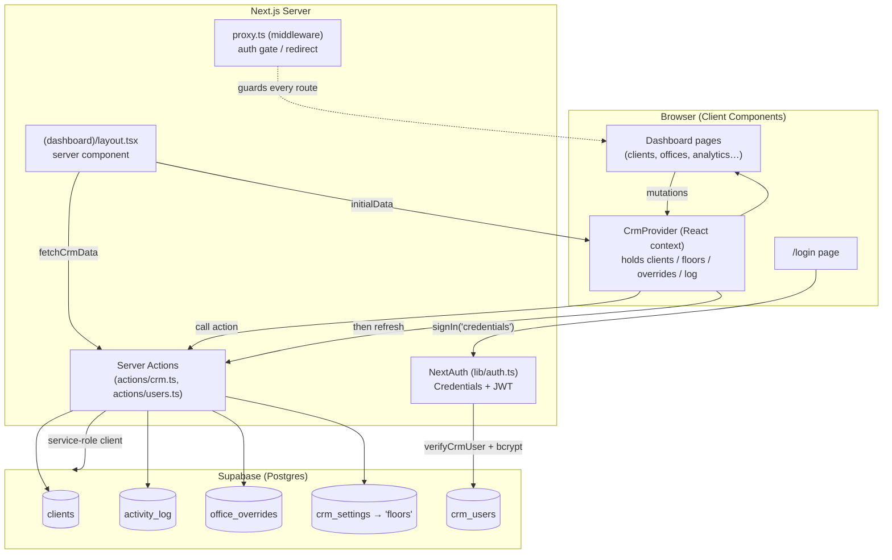
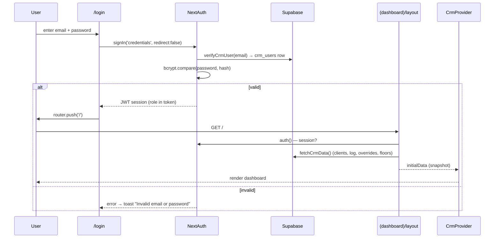
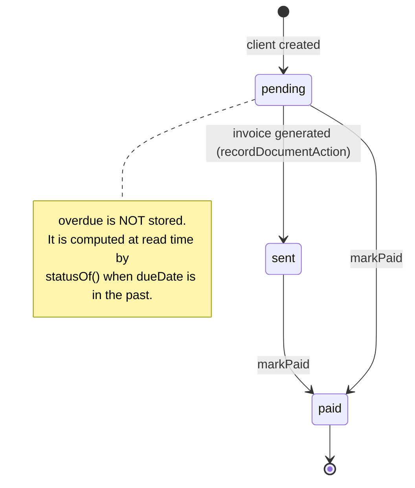
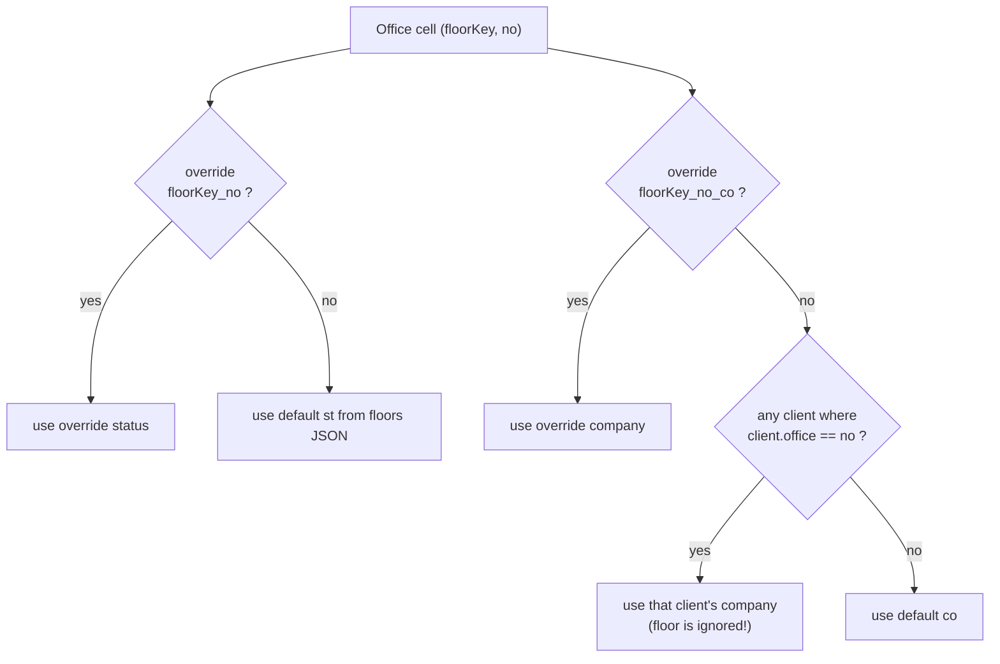
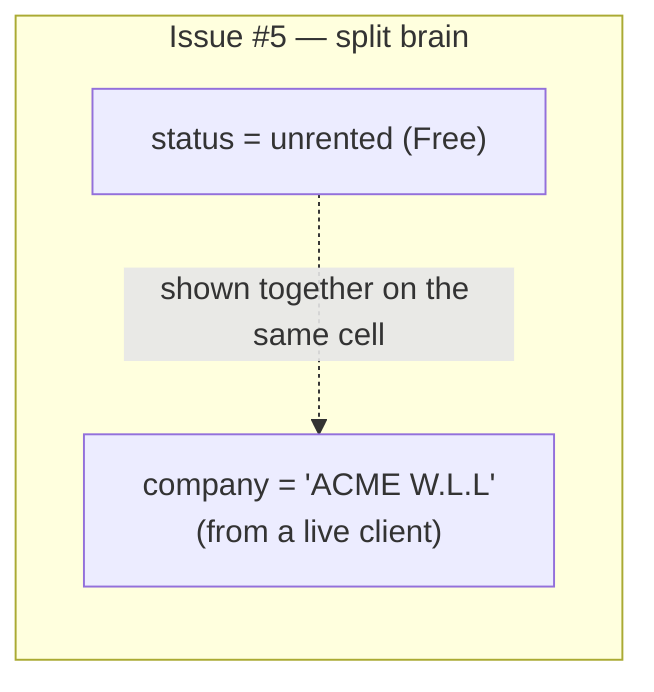

# Space IN CRM — How the system works

> Open this in VS Code's **Markdown Preview** (`Cmd+Shift+V`) to see the diagrams rendered.
> Diagrams are [Mermaid](https://mermaid.js.org/). File references use `path:line` so you can jump to the source.

---

## 1. Big picture — how the pieces connect

**Key point:** the browser never talks to Supabase directly. Everything goes through **server actions** using the Supabase **service-role key** (`lib/supabase/admin.ts`), which bypasses row-level security — so *all* authorization is done in app code (`requireSession` / `requireAdmin`), not in the database.

---

## 2. Login & page load

- Gate: `middleware`/`proxy.ts` redirects any unauthenticated route to `/login`.
- Floors come from `crm_settings.floors` if present, **else** fall back to `src/data/default-floors.json` (`mappers.ts:rowsToFloors`).
- If Supabase can't be reached, the layout shows a **DatabaseSetupBanner** and renders with an empty snapshot.

---

## 3. The mutation pattern (every write looks like this)

```mermaid
flowchart LR
  A["Page calls<br/>useCrm().addClient(...)"] --> B["Server action<br/>createClientAction"]
  B --> C["requireSession()"]
  C --> D["write to clients table"]
  D --> E["fetchCrmDataInternal()<br/>re-reads ALL data"]
  E --> F["syncOfficeFromClient()<br/>compute office override"]
  F --> G["persist override delta"]
  G --> H["logActivity(...)"]
  H --> I["return"]
  I --> J["provider.refresh()<br/>re-reads ALL data AGAIN"]
  J --> K["setState → pages re-render"]
```

Every mutation in `crm-provider.tsx` calls its action **and then `refresh()`**, which re-fetches the entire dataset (clients + up to 500 log rows + overrides + settings).

---

## 4. Client status lifecycle

`statusOf()` (`lib/client-status.ts`) overlays **overdue** on top of the stored status whenever `dueDate` is in the past. After **paid**, nothing auto-advances the next billing cycle.

---

## 5. How an office's status & company are resolved (offices page)

Two independent sources (status vs company) → they can disagree (see issue **#5** below). Client→office linking is **purely by office number, with no floor scoping** (`office-stats.ts:resolveOfficeCompany`, `office-sync.ts`).

---

## 6. Things that look illogical / risky

> These are observations from the current code — each is worth confirming before changing.

| # | What | Where | Why it's a problem |
|---|------|-------|--------------------|
| 1 | **Update & delete are logged as type `"created"`** | `actions/crm.ts` `updateClientAction`, `deleteClientAction` | The activity feed/icons will show "created" for edits and deletions. The description text says "updated"/"deleted" but the `type` is wrong. |
| 2 | **Clearing an office override never deletes it from the DB** | `crm-provider.tsx:clearOfficeOverride` → `saveOfficeOverridesAction` | It only **upserts the remaining keys**; removed keys stay in `office_overrides`. So a "cleared" office reappears on next load. |
| 3 | **Empty overrides map is a no-op** | `saveOfficeOverridesAction` (`if rows.length===0 return`) | You can never persist "all cleared". |
| 4 | **Double full re-fetch on every write** | actions call `fetchCrmDataInternal()`, then provider calls `refresh()` | Each mutation reads the whole dataset twice (clients + 500 log rows + overrides + settings). Slow and wasteful as data grows. |
| 5 | **Status and company come from different sources** | `resolveOfficeStatus` vs `resolveOfficeCompany` | An office can show a company name while still marked **Free/unrented** (or vice-versa) because the two are resolved independently. |
| 6 | **Client→office link ignores the floor** | `resolveOfficeCompany`, `syncOfficeFromClient` (`matchFloor` = *last* floor containing that number) | If the same office number exists on two floors, the link is ambiguous and "last match wins". Number is effectively the only key. |
| 7 | **No atomicity** | every action does write → sync → log as separate calls | A mid-sequence failure leaves partial state (e.g. client saved but office/log not updated). No transaction/rollback. |
| 8 | **Floors stored as one JSON blob** | `crm_settings.floors`, `saveFloorsAction` | Any floor edit rewrites the whole blob; two concurrent editors clobber each other. Also: once a blob is saved, the `default-floors.json` improvements no longer apply. |
| 9 | **`markPaid` doesn't roll the cycle** | `markPaidAction` | For rent/subscription, "paid" is terminal — no next due date / next invoice is generated automatically. |
| 10 | **All access uses the service-role key** | `lib/supabase/admin.ts` used everywhere | No DB-level security; staff vs admin and "who can see what" is enforced only in app code. Staff can read/write every client. |

---

## 7. Suggested clean-ups (if you want to act on the above)

1. Fix activity types: use `"updated"` / `"deleted"` (add to `ActivityType`) — issue #1.
2. Make `clearOfficeOverride` actually `delete` rows; let `saveOfficeOverridesAction` accept deletions — issues #2, #3.
3. Have actions **return the updated slice** and let the provider patch state locally instead of a full `refresh()` — issue #4.
4. Derive an office's status **and** company from one source of truth (the linked client), so they can't disagree — issues #5, #6.
5. Scope office numbers per floor (composite key `floorKey_no`) everywhere, including client linkage — issue #6.
6. Wrap multi-step writes in a Postgres function / transaction — issue #7.
7. Decide whether "paid" should auto-create the next period's invoice/due date — issue #9.
